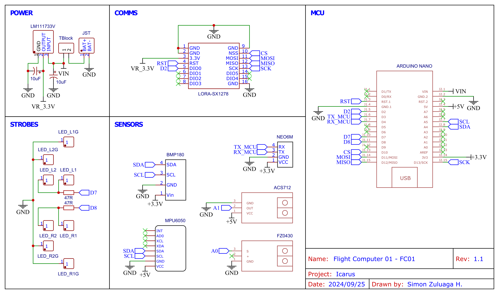

Code developed in Universidad de Antioquia by [Icarus](https://astra-ae.co/icarus/) aeromodelling project group from the [Voyager](https://astra-ae.co/voyager/) student research group.

All code was developed using OOP standards to make debugging easier.

# Hardware
## Transmitter (Flight computer)
- Arduino Nano
- BMP180
- MPU6050
- LoRa SX1278
- GPS NEO6M
- ACS712
- FZ0403
- 2 x LED
- LM1117 3.3V

## Receiver
- Arduino Pro Micro
- LoRa SX1278
- LCD Display
- SD Card module

# Transmitter
## Connections

| **MCU (e.g. Nano - Uno)** | **BMP180** | **MPU6050** | **GPS NEO6M** | **LoRa SX1278** | **ACS712** | **FZ0430** | **LED L** | **LED R** | **LM1117** |
|:---:|:---:|:---:|:---:|:---:|:---:|:---:|:---:|:---:|:---:|
| VIN | - | - | - | VCC | - | - | - | - | VOUT |
| 5 V | - | VCC | - | - | VCC | - | - | - | - |
| 3.3 V | VCC | - | VCC | - | - | - | - | - | - |
| GND | GND | GND | GND | GND | GND | GND | GND | GND | GND |
| RST | - | - | - | RST | - | - | - | - | - |
| D2 | - | - | - | DIO0 | - | - | - | - | - |
| D3 (TX) | - | - | RX | - | - | - | - | - | - |
| D4 (RX) | - | - | TX | - | - | - | - | - | - |
| D7 | - | - | - | - | - | - | + | - | - |
| D8 | - | - | - | - | - | - | - | + | - |
| D10 (CS) | - | - | - | CS | - | - | - | - | - |
| D11 (MOSI) | - | - | - | MOSI | - | - | - | - | - |
| D12 (MISO) | - | - | - | MISO | - | - | - | - | - |
| D13 (SCK) | - | - | - | SCK | - | - | - | - | - |
| A0 | - | - | - | - | - | OUT | - | - | - |
| A1 | - | - | - | - | OUT | - | - | - | - |
| A4 (SDA) | SDA | SDA | - | - | - | - | - | - | - |
| A5 (SCL) | SCL | SCL | - | - | - | - | - | - | - |

## Data sensing capabilities
- Span for sensing of each sensor

# Receiver
Receiver allows to show incoming data in a LCD Display for easy reading and saves data into a SD card module for further analysis.